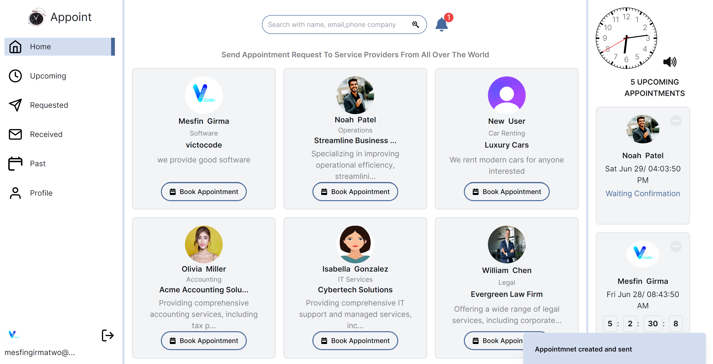
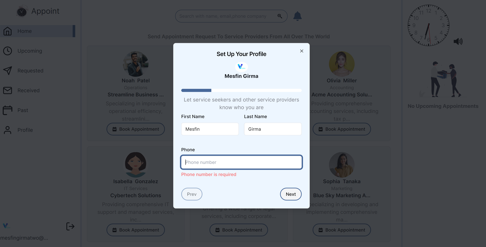
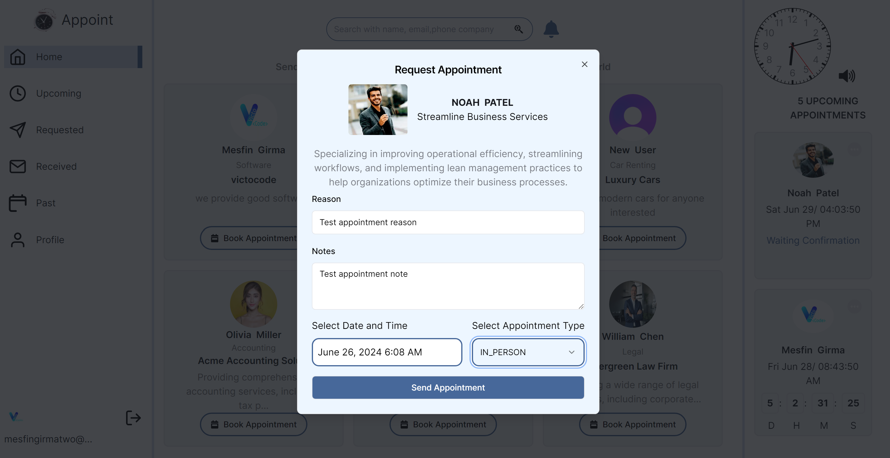
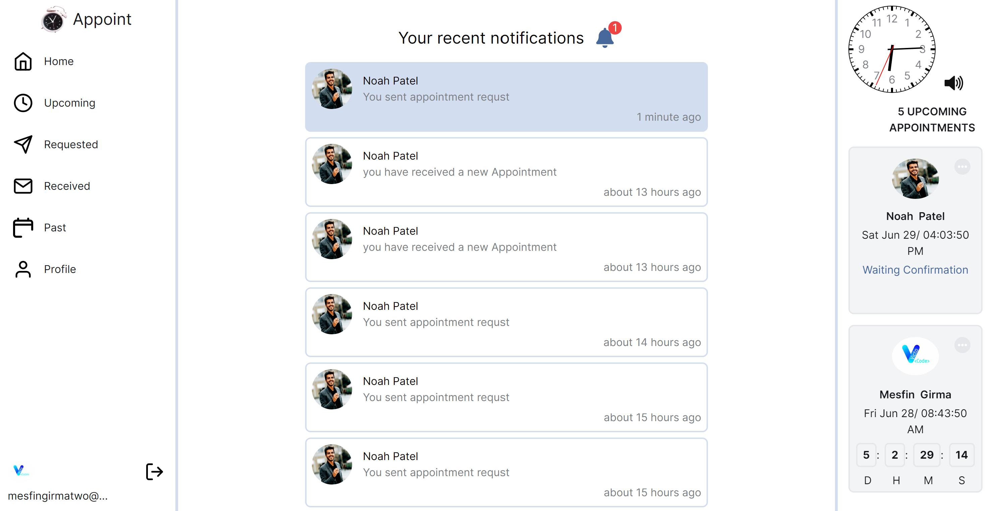
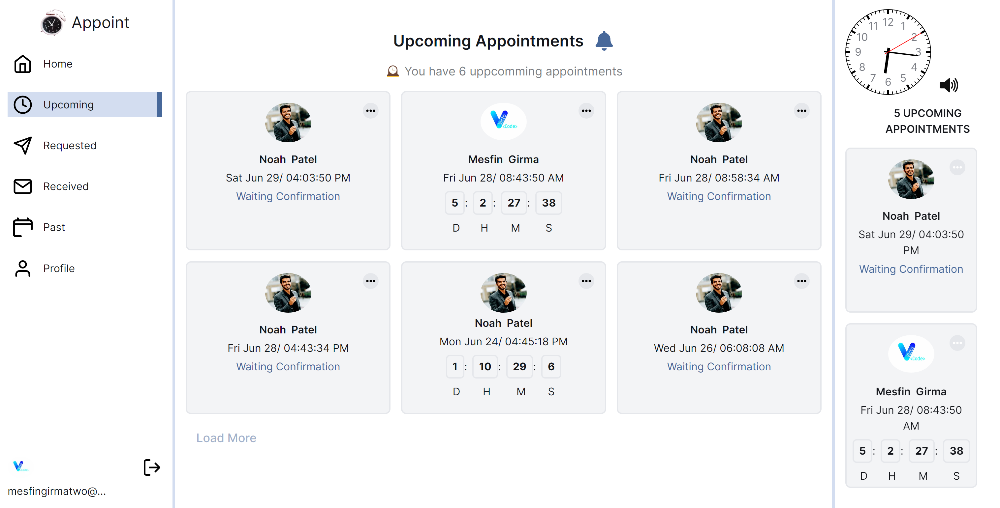
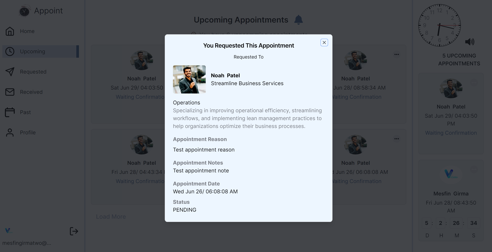

# Appoint 

🕝 Appoint 🕒 enables users to schedule appointments with doctors, professionals, and other service providers. I built it using Next.js, Prisma (an ORM), and PostgreSQL as the database, and I also integrated Clerk for authentication.
i  began this project journey on June 5th, I have made progress in developing the app. I have leveraged the free Next.js video tutorials from JavaScript Mastery, 

Key features of the Appointment Booking App:

1. Landing page
a minimal landing page
2. Authentication with Clerk: 
The app utilizes Clerk for user authentication, ensuring a secure and seamless sign-in experience.
3. User Profiles: 
The app prompts new users or those without a complete profile to create a profile as a service provider or a professional.
4. User Profile Management
 Users can view and update their profiles through the dedicated profile page.
5. Home Page: 
The home page displays a list of registered professionals and service providers, allowing users to search and browse. It also enables users to check the availability of professionals and request appointments, which trigger email notifications to the service providers. Once an appointment is accepted, the user receives a confirmation, and a countdown timer is displayed.
6. Appointment Scheduling: 
The app supports two types of appointments: virtual and in-person. It sends email alerts to both participants one day before the scheduled appointment.
7. Appointment Management:
 The app provides separate pages to manage upcoming appointments, received appointment requests, requested appointments, and past appointments. These pages utilize pagination to enhance the user experience.
8. In app notification: Realtime in appnotification by integrating the app with firebase realtime database 

## Information
- Title:  `Appoint`
- Authors:  `mesfincode`
- Live Website: [Appoint](http://appoint-beige.vercel.app/)

## Tech Stack
- [Next.js](https://nextjs.org/)
- [Shadcn/ui](https://ui.shadcn.com/)
- [Tailwindcss](https://tailwindcss.com/)
- [Firebase](https://console.firebase.google.com/)
## **Prerequisites**

Make sure you have the following installed on your machine:

- [Git](https://git-scm.com/)
- [Node.js](https://nodejs.org/en)
- [npm](https://www.npmjs.com/) (Node Package Manager)

## **Cloning the Repository**
```bash
git clone https://github.com/mesfincode/Appoint.git
cd Appoint
```

## **Installation**

Install the project dependencies using npm:

```bash
npm install
```

## **Running the Project**

```bash
npm run dev
```

## Screenshoots
### Home Page

### Onboarding page

### Creating Appointment

### Notification

### Upcoming Appointment

### Appointment Detail


